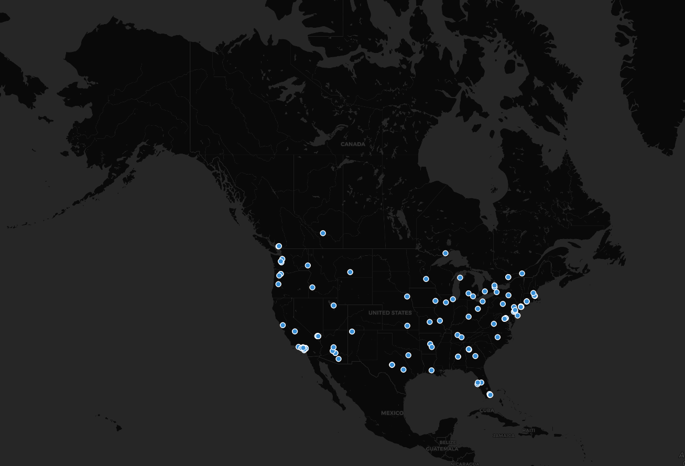

# Tweets About 'COVID vaccine' or 'vaccine'

Tram-Anh Nguyen
01/29/21
GEOG 458

##### Analysis
We can see that the map accurately reflects the current state of the pandemic. The recently approved vaccines has been given to frontline workers and slowly dispatched to the population that needs it after frontline works, such as elders. There are no extreme patterns that we can recognize in this map but we can see clusters around populated-cities such as the Los Angeles area in California or Puget Sound area in Washington State. We can see that people are tweeting about their vaccination experience or expressing their opinions or beliefs on the vaccine.
